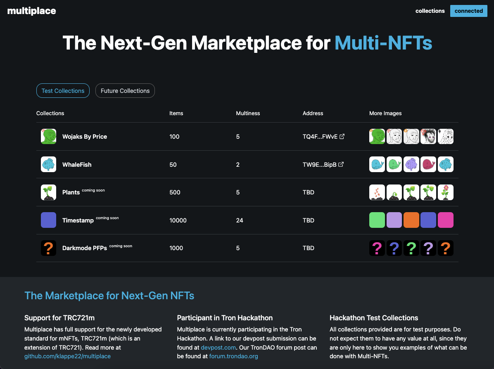
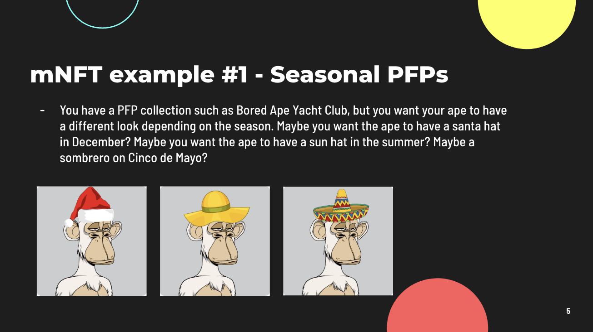
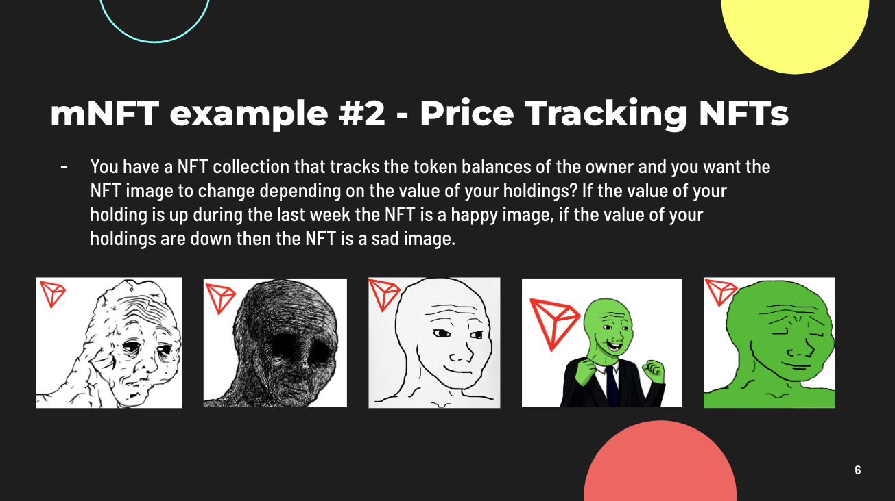
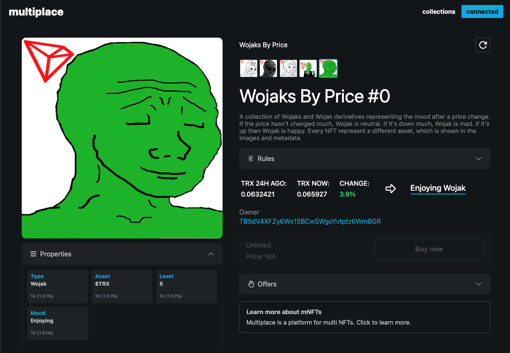
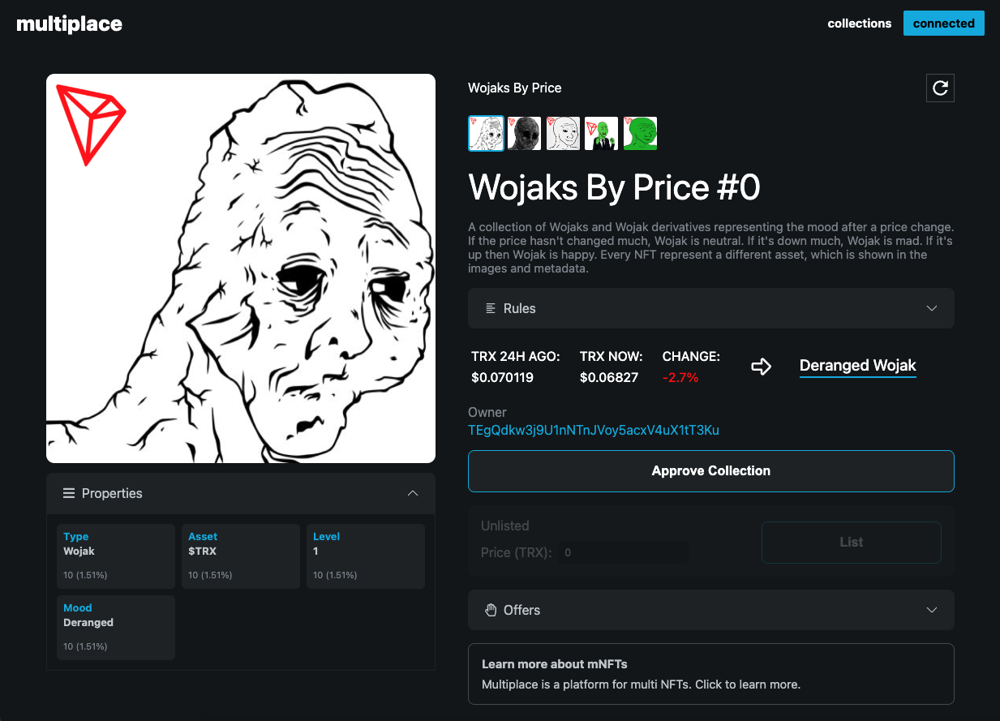
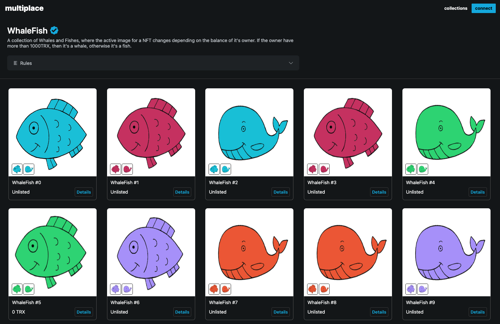

  

**Project Name**: Multiplace & mNFTs - Next-Gen Marketplace for mNFTs (multi NFTs)

**Project Track**: NFT

**Team Name**: Multi

**Team Member(s)**: @klappetron, @karilplazik

**DevPost URL**: https://devpost.com

**Video Submission**: https://youtube.com

**Project Repo/Website**

**Github**: https://github.com/klapka91/multiplace

**Website**: https://multiplace.io & https://testnet.multiplace.io

**Project Goal**:

Previously, there have been two dominant standards for NFTs, TRC721 and TRC1155. In this project, we represent a new standard (TRC721m) that we believe could be the dominant one for the next-generation of NFTs which we call Multi-NFTs, or mNFTs. The goal for this project is to create:

1. A new token standard for Multi NFTs (TRC721m)
2. A marketplace for trading and viewing mNFTs
3. Some mNFT test collections (Wojaks By Price and WhaleFish)

**Project Info & Details**:

*Why*?

NFTs as we know them today only holds a link to one image per NFT. There is currently no way to create NFTs that hold multiple images in one token. In the future, we believe that people will want to have NFTs that can change image as a reaction to external factors.

We give you three examples:

3. You create a NFT collection, where you want to encourage people to hold the NFT instead of just trading it for profit. With mNFTs you can create them in a way so that the NFT changes depending on how long it hasn't been sold. So if someone has only held it in 1 day, the NFT shows the level 1 image, and for every day the NFTs has not been sold, it get's leveled up and thereby gets more rare.

*How?*

We represent:
1. TRC721m, the Standard for Multi Non-Fungible Tokens (mNFTs)
2. Multiplace, the marketplace for Multi-NFTs
3. Some mNFT test collections that you can check out

**TRC721m:**

Github link to the TRC721m interface: https://github.com/klappe22/multiplace

Quick explanation video: https://youtube.com/

**Multiplace - The Next-Generation NFT Marketplace for mNFTs**

Multiplace is a mNFT marketplace. What apenft.io is to normal NFTs, Multiplace want to be for Multi-NFTs. We thereby introduce multiplace.io, a marketplace with native support for mNFTs.

**Test Collections (Wojaks By Price, WhaleFish and Plants)**

We have done two test collections, to show you examples of what's possible with mNFTs.

**Wojaks By Price**

A collection of Wojaks and Wojak derivatives representing the mood after a price change. If the price hasn't changed much, Wojak is neutral. If it's down much, Wojak is mad. If it's up then Wojak is happy. Every NFT represent a different asset, which is shown in the images and metadata.
This Wojak tracks the TRX price (from decentralized WinkLink price feeds) and changes image depending on the price change. You can create Wojaks that tracks whatever asset you like, such as ETH and BTC.

These are the exact rules for the Wojaks By Price collection (with TRX as the asset):

| **Price Change**                                                                   | **Result**                                                                                                                                                                      |
| ------------------------------------------------------------------------------ | ------------------------------------------------------------------------------------------------------------------------------------------------------------------------------------ |
| `$TRX change is +2.5% or more ->`| Enjoying Wojak                                                                                                                                                 |
| `$TRX change is between 1% and 2.5% ->`| Happy Wojak                                                                                                                                                 |
| `$TRX change is between 1% and -1% ->`| Neutral Wojak                                                                                                                                                 |
| `$TRX change is between -1% and -2.5% ->`| Withered Wojak                                                                                                                                                 |
| `$TRX change is between -2.5% or more ->`| Deranged Wojak                                                                                                                                                 |

This is how the NFT looks after a +3.9% day:

This is how the NFT looks after a -2.7% day:

Keep in mind that this is the same NFT in both images, just that the images are different depending on the price of TRX! You can follow this exact NFT and see which version it is showing right now at https://multiplace.io/collections/wojaksbyprice/0 . You can also view at https://apenft.io/assets/TQ4F6a5ZFCL8pEVXJpckkE3MMNKgxXFWvE/0 but since Ape doesn't support mNFTs natively, it's not sure that it will show you the correct image.
  

**WhaleFish**

As a proof of concept, we also did a collection called "WhaleFish", which is a collection of mNFTs that changes depending on the balance of their owner. If the owner owns more than 1000 TRX then they are a Whale, else they are a Fish. You can find this collection at https://multiplace.io/collections/whalefish , and here is a sneak peek:

**Ideas for mNFTs**

- mNFTs that change depending on how long they have been held. Maybe you want a project where your holders get the most benefits? With mNFTs you can design them in a way so that they evolve depending on how long they have been held.

- A collection that have images that depend on the time of the day. If you are in the morning, maybe the background of your PFP should have a sun rising? And if it’s night, the NFT could go into dark mode.

And countless other examples! Let us know down below if you have ideas for an mNFT collection. As long as you want a collection where the NFT can alternate between different images, mNFTs are perfect.

**Project Milestones**

1. Keep working on the collection that you can see on the home page with the comment "coming soon". These projects are 
    - Plants
    - Darkmode PFPs
    - Timestamps.      

2. Multiplace currently only supports Tron Mainnet and the Nile Testnet, but we want to support the Shasta Testnet aswell.

3. Make a Creation and Minting page, where users can come up with mNFTs collection without having to code, similar to how apenft have done it one their side for normal NFTs.

